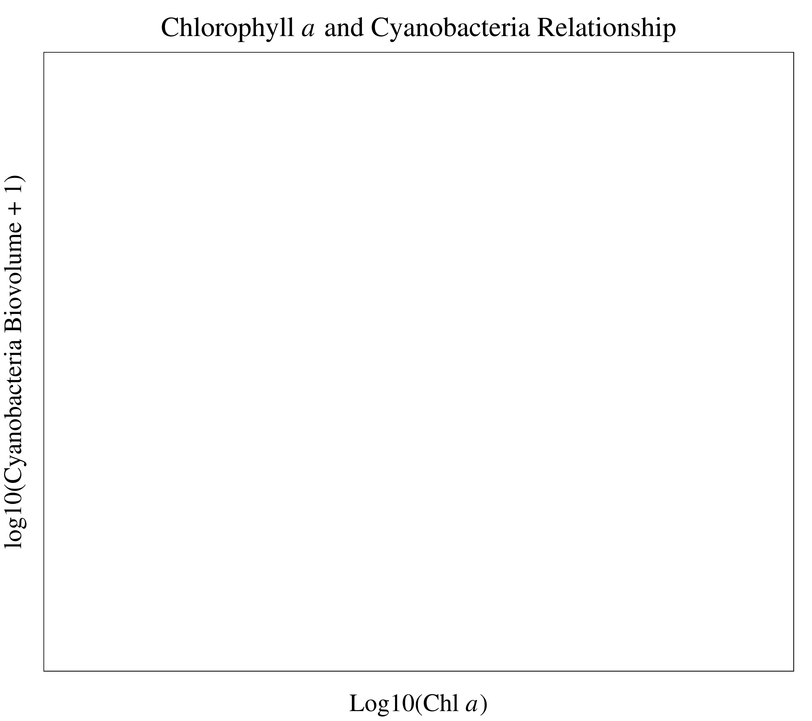

#Expanding Models of Lake Trophic State to Predict Cyanobacteria in Lakes:
##A Data Mining Approach


###*Jeffrey W. Hollister, W. Bryan Milstead, and Betty J. Kreakie*


####**U.S. Environmental Protection Agency, Office of Research and Development, National Health and Environmental Effects Research Laboratory, Atlantic Ecology Division, Narragansett, RI 02882**


##Introduction
Cyanobacteria are an important taxonomic group associated with harmful algal blooms in lakes. Understanding the drivers of cyanobacteria presence has important implications for lake management and for the protection of human and ecosystem health.  Chlorophyll a concentration, a measure of the biological productivity of a lake, is one such driver and is largely, although not exclusively, determined by nutrient inputs.   As nutrient inputs increase, productivity increases and lakes transition from low trophic state (e.g. oligotrophic) to higher trophic states (e.g. hypereutrophic).  These broad trophic state classifications are associated with ecosystem health and ecosystem services/disservices (e.g. recreation, aesthetics, fisheries, and harmful algal blooms).  Thus, models of trophic state might be used to predict things like cyanobacteria.

We have three goals for this preliminary research:

1. Build and assess models of lake trophic state
2. Assess ability to predict trophic state in lakes without available *in situ* water quality data
3. Explore association between cyanobacteria and trophic in order to expand models.

##Data and Modeling Methods

**Data**
We utilize four primary sources of data for this study. These are outlined below and in Table 1.

1. National Lakes Assessment (NLA) 2007: The NLA data were collected during the summer of 2007 and the final data were released in 2009.  With consistent methods and metrics collected at 1056 locations across the conterminous United States (Map 1), the NLA provides a unique opportunity to examine broad scale patterns in lake productivity.  The NLA collected data on biophysical measures of lake water quality and habitat.  For this analysis we primarily examined the water quality measurements from the NLA [@usepa2009national].
2. National Land Cover Dataset (NLCD) 2006: The NLCD is a nationally collected land use land cover dataset.  We collected total land use land cover and total percent impervious surface within a 3 kilometer buffer surrounding the lake to examine larger landscape-level effects [@homer2004development;@xian2009updating].  
3. Modeled lake morphometry: Various measures of lake morphometry (i.e. depth, volume, fetch, etc.) are important in understanding lake productivity, yet many of these data are difficult to obtain for large numbers of lakes over broad regions.  To add this information we modeled lake morphometry [@hollister2010volume;@hollister_predicting_2011;@Lakmorpho2014;@NLMDInPrep].
4. Estimated Cyanobacteria Biovolumes: Cyanobacteria biovolumes is a truer measure of Cyanobacteria dominance than abundance as there is great variability in the size within and between species.  To account for this, Beaulieu *et al.* [-@beaulieu2013nutrients] used literature values to estimate biovolumes for the taxa in the NLA.  They shared this data and we have summed that information on a per-lake basis.  


```
## Error: object 'predictors_all' not found
```

```
## Error: object 'predictors_all' not found
```

```
## Error: object 'type' not found
```

```
## Error: object 'type' not found
```

```
## Error: object 'predictors_all' not found
```


```
## Error: object 'hkm2014Data' not found
```

```
## Error: error in evaluating the argument 'obj' in selecting a method for function 'coordinates': Error in coordinates(lakes_alb) : 
##   error in evaluating the argument 'obj' in selecting a method for function 'coordinates': Error: object 'lakes_alb' not found
```

```
## Error: error in evaluating the argument 'x' in selecting a method for function 'spTransform': Error: object 'lakes_alb_sp' not found
```

```
## Error: error in evaluating the argument 'obj' in selecting a method for function 'coordinates': Error: object 'lakes_dd' not found
```

```
## Error: object 'lakes_dd' not found
```

```
## Error: object 'lakes_dd' not found
```
**Predicting Trophic State with Random Forests**

Random forest is a machine learning algorithm that aggregates numerous decision trees in order to obtain a consensus prediction of the response categories [@breiman2001random].  Bootstrapped sample data is recursively partitioned according to a given random subset of predictor variables and completely grown without pruning.   With each new tree, both the sample data and predictor variable subset is randomly selected.  

While random forests are able to handle numerous correlated variables without a decrease in prediction accuracy, unusually large numbers of related variables can reduce accuracy and increase the chances of over-fitting the model.  This is a problem often faced in gene selection and in that field, a variable selection method based on random forest has been succesfully applied [@diaz2006gene].  We use varselRF in R to initially examine the importance of the water quality and GIS derived variables and select a subset, the reduced model, to then pass to random forest[@diaz-uriarte2010varSelRF]. 

Using R’s randomForest package, we pass the reduced models selected with varSelRF and calculate confusion matrices, overall accuracy and kappa coeffecient [@liaw2002randomForest]. From the reduced model random forests we collect a consensus prediction and calculate a confusion matrix and summary stats.

**Model Details**

Using a combination of the `varSelRF` and `randomForest` we ran models for six combinations of variables and trophic state classifications.  These combinations included different combinations of the Chlorphyll *a* trophic states (Table 2) along with all variables and the GIS only variables (i.e. no *in situ* infromation).  The six model combinations were:

1. Chlorophyll *a* trophic state - 4 class = All variables (*in situ* water quality, lake morphometry, and landscape)
2. Chlorophyll *a* trophic state - 3 class = All variables (*in situ* water quality, lake morphometry, and landscape)
3. Chlorophyll *a* trophic state - 2 class = All variables (*in situ* water quality, lake morphometry, and landscape)
4. Chlorophyll *a* trophic state - 4 class = All variables (lake morphometry, and landscape)
5. Chlorophyll *a* trophic state - 3 class = All variables (lake morphometry, and landscape)
6. Chlorophyll *a* trophic state - 2 class = All variables (lake morphometry, and landscape)


|Trophic State (4) |Trophic State (3) |Trophic State (2) |Cut-off |
|:-----------------|:-----------------|:-----------------|:-------|
|oligo             |oligo             |oligo/meso        |<= 0.2  |
|meso              |meso/eu           |oligo/meso        |>2-7    |
|eu                |meso/eu           |eu/hyper          |>7-30   |
|hyper             |hyper             |eu/hyper          |>30     |

##Results


###Model 1: 4 Trophic States ~ All Variables


```
## Saving 6 x 8 in image
```

```
## Warning: font family not found in Windows font database
## Warning: font family not found in Windows font database
```

```
## Saving 6 x 8 in image
```

```
## Warning: font family not found in Windows font database
## Warning: font family not found in Windows font database
```
\newpage

\newpage

\newpage

\newpage

\newpage

Total accuracy for Model 1 is 0.667% and the Cohen's Kappa is 0.546.


###Model 2: 3 Trophic States ~ All Variables


```
## Saving 6 x 8 in image
```

```
## Warning: font family not found in Windows font database
## Warning: font family not found in Windows font database
```

```
## Saving 6 x 8 in image
```

```
## Warning: font family not found in Windows font database
## Warning: font family not found in Windows font database
```
\newpage

\newpage

\newpage

\newpage

\newpage

Total accuracy for Model 2 is 0.799% and the Cohen's Kappa is 0.618.

###Model 3: 2 Trophic States ~ All Variables


```
## Saving 6 x 8 in image
```

```
## Warning: font family not found in Windows font database
## Warning: font family not found in Windows font database
```

```
## Saving 6 x 8 in image
```

```
## Warning: font family not found in Windows font database
## Warning: font family not found in Windows font database
```
\newpage

\newpage

\newpage

\newpage

\newpage

Total accuracy for Model 3 is 0.87% and the Cohen's Kappa is 0.741.

###Model 4: 4 Trophic States ~ GIS Only Variables


```
## Saving 6 x 8 in image
```

```
## Warning: font family not found in Windows font database
## Warning: font family not found in Windows font database
```

```
## Saving 6 x 8 in image
```

```
## Warning: font family not found in Windows font database
## Warning: font family not found in Windows font database
```
\newpage

\newpage

\newpage

\newpage

\newpage

Total accuracy for Model 4 is 0.482% and the Cohen's Kappa is 0.292.

###Model 5: 3 Trophic States ~ GIS Only Variables


```
## Saving 6 x 8 in image
```

```
## Warning: font family not found in Windows font database
## Warning: font family not found in Windows font database
```

```
## Saving 6 x 8 in image
```

```
## Warning: font family not found in Windows font database
## Warning: font family not found in Windows font database
```
\newpage

\newpage

\newpage

\newpage

\newpage

Total accuracy for Model 5 is 0.673% and the Cohen's Kappa is 0.343.

###Model 6: 2 Trophic States ~ GIS Only Variables


```
## Saving 6 x 8 in image
```

```
## Warning: font family not found in Windows font database
## Warning: font family not found in Windows font database
```

```
## Saving 6 x 8 in image
```

```
## Warning: font family not found in Windows font database
## Warning: font family not found in Windows font database
```
\newpage

\newpage

\newpage

\newpage

\newpage

Total accuracy for Model 6 0.758% and the Cohen's Kappa is 0.517.

###Associating Trophic State and Cyanobacteria


```
## Error: object 'hkm2014Data' not found
```

\newpage

```
## Error: object 'hkm2014Data' not found
```

\newpage

```
## Error: object 'hkm2014Data' not found
```

\newpage

```
## Error: object 'hkm2014Data' not found
```

```
## Error: object 'scp_df' not found
```


##Poster Source on GitHub
All of the The materials that make up this poster are available via GitHub.  Included in this repository are an R Markdown document, and R Package with data, and the final poster layout as .svg or .pdf.  Please use the QR Code to access this repository.

\newpage

\newpage

##References


